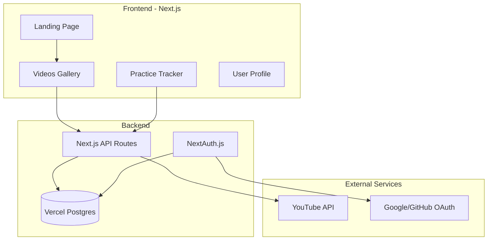

# Tennis Learning Platform - 网球学习平台

## 技术栈

| 类别 | 技术选择 | 说明 |

|------|----------|------|

| 框架 | Next.js 15 (App Router) | 最新版本，支持RSC和Server Actions |

| 样式 | Tailwind CSS + Framer Motion | 高端质感 + 流畅动画 |

| 认证 | NextAuth.js v5 | 支持Google/GitHub OAuth登录 |

| 数据库 | Vercel Postgres + Prisma | 免费额度充足，与Vercel无缝集成 |

| 视频 | YouTube Data API v3 | 自动获取指定频道/播放列表视频 |

| 部署 | Vercel | 零配置部署 |

## 架构概览



## 页面结构

### 1. Landing Page (/)

高端深色主题设计要点：

- **Hero Section**: 全屏视觉冲击，网球场深色渐变背景，动态粒子效果
- **Typography**: 使用 `Playfair Display` (标题) + `Space Grotesk` (正文) 字体组合
- **配色方案**: 深色底 (#0a0a0a) + 网球绿点缀 (#c8e600) + 金色高亮 (#d4af37)
- **Featured Section**: 精选视频卡片，hover 时优雅的缩放动画
- **CTA**: "Start Learning" 按钮，发光边框效果

### 2. Videos Page (/videos)

- 分类筛选（发球、正手、反手、网前、步法、战术）
- 瀑布流/网格布局展示视频卡片
- 视频详情模态框（内嵌YouTube播放器）
- 收藏按钮（需登录）

### 3. Practice Tracker (/practice)

- 练习日历视图
- 添加练习记录（日期、时长、练习内容、笔记）
- 统计图表（每周练习时长、技能进度）
- 目标设定与追踪

### 4. Profile (/profile)

- 用户信息展示
- 收藏的视频列表
- 练习历史与统计

## 数据模型 (Prisma Schema)

```prisma
model User {
  id            String    @id @default(cuid())
  name          String?
  email         String    @unique
  image         String?
  favorites     Favorite[]
  practices     Practice[]
  createdAt     DateTime  @default(now())
}

model Video {
  id            String    @id @default(cuid())
  youtubeId     String    @unique
  title         String
  thumbnail     String
  channelName   String
  category      String    // serve, forehand, backhand, volley, footwork, tactics
  duration      String
  favorites     Favorite[]
  createdAt     DateTime  @default(now())
}

model Favorite {
  id        String   @id @default(cuid())
  user      User     @relation(fields: [userId], references: [id])
  userId    String
  video     Video    @relation(fields: [videoId], references: [id])
  videoId   String
  createdAt DateTime @default(now())
  @@unique([userId, videoId])
}

model Practice {
  id        String   @id @default(cuid())
  user      User     @relation(fields: [userId], references: [id])
  userId    String
  date      DateTime
  duration  Int      // minutes
  category  String
  notes     String?
  createdAt DateTime @default(now())
}
```

## 项目目录结构

```
joseph-love-tennis/
├── app/
│   ├── layout.tsx          # 根布局，深色主题
│   ├── page.tsx            # Landing Page
│   ├── videos/
│   │   └── page.tsx        # 视频画廊
│   ├── practice/
│   │   └── page.tsx        # 练习记录
│   ├── profile/
│   │   └── page.tsx        # 用户主页
│   ├── api/
│   │   ├── auth/[...nextauth]/route.ts
│   │   ├── videos/route.ts
│   │   ├── favorites/route.ts
│   │   └── practices/route.ts
│   └── globals.css
├── components/
│   ├── ui/                 # 通用UI组件
│   ├── landing/            # Landing专用组件
│   ├── videos/             # 视频相关组件
│   └── practice/           # 练习相关组件
├── lib/
│   ├── prisma.ts           # Prisma客户端
│   ├── auth.ts             # NextAuth配置
│   └── youtube.ts          # YouTube API封装
├── prisma/
│   └── schema.prisma
├── public/
└── package.json
```

## YouTube API 集成

需要在 Google Cloud Console 创建项目并启用 YouTube Data API v3：

1. 创建 API Key（用于获取公开视频数据）
2. 配置推荐的网球教学频道/播放列表（如 Essential Tennis, Top Tennis Training 等）
3. 定期同步视频到数据库（可通过 Vercel Cron Jobs 实现）

## 实施步骤
